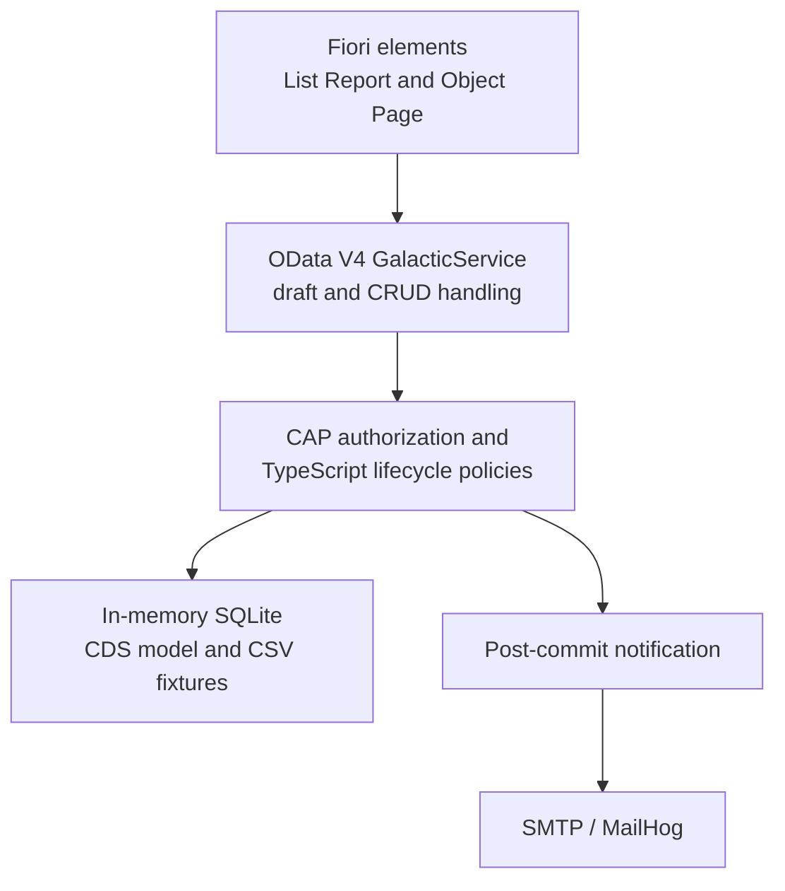
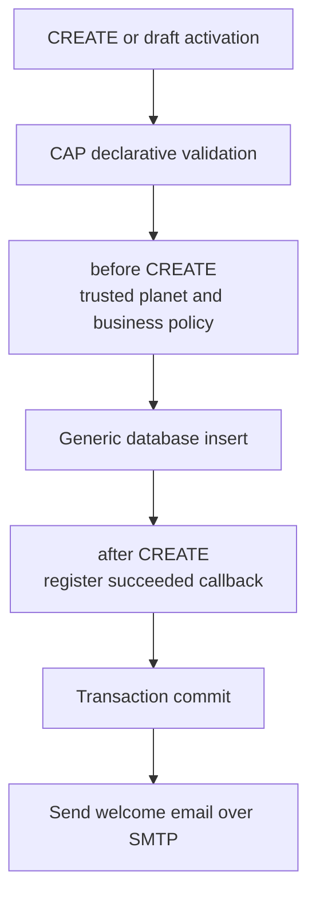

# Galactic Spacefarer Adventure

A full-stack SAP CAP and Fiori elements implementation of the Galactic Spacefarer interview exercise. The application manages spacefarers, validates their journey statistics, isolates records by the authenticated user's planet, and sends a welcome email after a successful creation.

## Assignment Coverage

| Assignment area        | Implementation                                                                                                                                         |
| ---------------------- | ------------------------------------------------------------------------------------------------------------------------------------------------------ |
| Spacefarer data model  | CDS entities for Spacefarers, Departments, and Positions with UUID keys, managed audit fields, defaults, ranges, and associations.                     |
| Protected service      | OData V4 CRUD service protected by a role and planet-based instance restriction.                                                                       |
| Before-create behavior | CAP declarative validation plus a TypeScript `before CREATE` handler for trusted planet assignment, numeric null handling, and assignment consistency. |
| After-create behavior  | A TypeScript `after CREATE` handler registers a post-commit SMTP welcome notification.                                                                 |
| List Report            | Fiori elements table with spacefarer identity, planet, assignment, stardust, navigation skill, and spacesuit color.                                    |
| Object Page            | Draft-enabled details page where users can create and edit spacefarers within their planet.                                                            |
| Local database         | In-memory SQLite with deterministic CSV fixtures for development and tests.                                                                            |

## Quick Start

Prerequisites:

- Node.js 24.21.0 LTS with its bundled npm
- Docker Desktop with Linux containers only when using MailHog
- VS Code with the recommended SAP extensions when using the integrated debugger

The CAP CLI is a project dependency. A global CDS installation is unnecessary.

Install the locked dependencies and start the Fiori application:

```powershell
npm ci
npm run watch-spacefarer
```

Open the [Spacefarer application](http://localhost:4004/spacefarers/index.html). The OData service is available at `http://localhost:4004/odata/v4/galactic`.

`npm run watch-spacefarer` restarts CAP after source changes and opens the application. Use `npm start` when file watching and automatic browser startup are unnecessary.

SQLite runs in memory. CAP recreates the database and reloads the fixtures under `db/data` whenever the server restarts.

## Start with MailHog

MailHog captures welcome emails locally instead of delivering them to external recipients:

```powershell
docker compose up -d mailhog
npm run watch-spacefarer
```

Open the [MailHog inbox](http://localhost:8025). SMTP listens on `127.0.0.1:1025`, and both published ports are restricted to the local machine.

Stop and remove the MailHog container with:

```powershell
docker compose down
```

Copy `.env.example` to `.env` to change the SMTP host, port, sender, security, credentials, or timeouts. Configure `SMTP_USER` and `SMTP_PASSWORD` together when the selected SMTP provider requires authentication.

## Debug in VS Code

The workspace provides three **Run and Debug** configurations:

| Configuration            | Behavior                                                                                                                          |
| ------------------------ | --------------------------------------------------------------------------------------------------------------------------------- |
| **CAP: Debug**           | Type-checks and starts CAP with the Node.js debugger attached.                                                                    |
| **CAP: Debug + MailHog** | Starts MailHog, starts CAP, and opens the Fiori application in a debug-enabled Chrome window. Stopping the session stops MailHog. |
| **CAP: Debug tests**     | Type-checks and runs the Vitest suite with debugging enabled.                                                                     |

Install the workspace recommendations when VS Code offers them. They include SAP CDS language support and the SAP Fiori tools extension pack.

## Demo Users

These credentials are public development fixtures. They are not production accounts.

| Username          | Password               | Role             | Planet |
| ----------------- | ---------------------- | ---------------- | ------ |
| `earth-user`      | `earth-demo`           | `SpacefarerUser` | Earth  |
| `earth-colleague` | `earth-colleague-demo` | `SpacefarerUser` | Earth  |
| `mars-user`       | `mars-demo`            | `SpacefarerUser` | Mars   |

Use a private browser session when switching users because browsers cache Basic authentication credentials.

The project also contains two negative test identities:

| Username          | Password          | Purpose                                   |
| ----------------- | ----------------- | ----------------------------------------- |
| `planetless-user` | `planetless-demo` | Has the role but no planet attribute.     |
| `roleless-user`   | `roleless-demo`   | Has a planet but lacks the required role. |

## Architecture



The Fiori application is metadata-driven. CDS annotations define the List Report columns, filter fields, Object Page sections, value helps, labels, and read-only origin planet. The root UI5 resource bundle provides English text; another locale can be added later without changing the annotation keys.

## Domain and Validation

`Spacefarers` contains the assignment fields plus the exercise-specific values `originPlanet`, `spacesuitColor`, `stardustCollection`, and `wormholeNavigationSkill`. Departments and Positions are shared read-only catalogs. A position is valid only with its matching department.

CAP owns ordinary input validation:

- `@mandatory` rejects missing or blank names and email.
- `@assert.range` requires non-negative stardust and a navigation skill between 0 and 100.
- `@assert.target` verifies referenced departments and positions.
- CDS defaults initialize stardust to `0` and navigation skill to `1` when omitted.

TypeScript handles rules that depend on request identity or persisted related data. It derives `originPlanet` from the authenticated user, prevents reassignment, rejects explicit nulls for the defaulted numeric fields, and verifies department/position consistency across partial updates.

Validation failures use structured OData errors with readable messages and affected-property targets. Fiori can associate those errors with the corresponding fields, including errors returned during draft activation.

## Creation and Notification Lifecycle



The welcome email is attempted only after the transaction succeeds. A delivery failure is logged and does not undo the committed Spacefarer or change the successful API response. Delivery is best effort; this version has no durable outbox or automatic retry.

Seed loading does not invoke the service create lifecycle, so starting the application does not send welcome messages for fixture records.

## Security Model

- CAP Basic authentication provides fixed identities in development and tests.
- `SpacefarerUser` is required for every Galactic service request.
- A CDS instance restriction limits active Spacefarer access to `originPlanet = $user.planet`.
- Additional navigation protection preserves planet isolation through active and draft associations.
- CAP draft ownership prevents users from accessing another user's draft, including users from the same planet.
- Catalogs are readable by authorized users and reject writes.
- The server derives the origin planet and rejects client attempts to select or change it.

The static application shell may load before authentication, but every application data request is protected. The production profile selects JWT authentication and deliberately has no mock-user fallback. Connecting a real identity provider is outside this local exercise.

There is no administrator role, cross-planet bypass, or planet-reassignment API.

## Fiori Behavior

The List Report displays the required stardust and spacesuit fields along with identity, planet, navigation skill, department, and position. Fiori and OData provide filtering, sorting, count handling, and server-side paging.

Selecting a row opens the Object Page. Draft support enables create, edit, activate, and discard flows. Users can edit the spacefaring statistics requested by the assignment, while Origin Planet remains read-only and server-controlled.

## Tests and Quality Checks

Run the complete project checks with:

```powershell
npm run typecheck
npm run lint:frontend
npm run build:frontend
npm test
npm run format:check
docker compose config --quiet
```

The routine Vitest suite starts real CAP test servers with isolated in-memory SQLite databases. It covers the domain model, OData CRUD and drafts, authorization, cross-planet isolation, navigation and batch requests, Fiori metadata, validation errors, and notification behavior. SMTP is replaced with a test double during routine tests.

With MailHog running, execute the opt-in SMTP integration test:

```powershell
npm run test:mailhog
```

CodeScene safeguards are used on changed TypeScript files to prevent maintainability regressions.

## Project Guide

| Path                           | Purpose                                                               |
| ------------------------------ | --------------------------------------------------------------------- |
| `db/schema.cds`                | Persistence model, defaults, ranges, and associations.                |
| `db/data/`                     | Deterministic development fixtures.                                   |
| `srv/galactic-service.cds`     | Protected draft-enabled OData service.                                |
| `srv/galactic-constraints.cds` | Service-level required fields and validation messages.                |
| `srv/galactic-service.ts`      | Lifecycle-handler registration.                                       |
| `srv/lifecycle/`               | Planet, assignment, validation, isolation, and notification policies. |
| `srv/services/`                | SMTP transport and welcome-message construction.                      |
| `app/spacefarer/`              | TypeScript Fiori elements application and annotations.                |
| `test/`                        | Backend, metadata, authorization, lifecycle, and notification tests.  |
| `compose.yaml`                 | Local MailHog service.                                                |
| `doc/`                         | Assignment, design decisions, and implementation history.             |

## Design Decisions and Future Work

The exercise leaves several business details open. This implementation makes the following choices:

- Departments and Positions are shared reference data, while Spacefarers are planet-scoped.
- Assignment is optional, but a selected position requires its matching department.
- Users on the same planet share active records; drafts remain private to their creator.
- The backend always owns the origin planet.
- Email is sent after commit and never controls transaction success.
- SQLite and the demo identities are limited to local development and testing.

Future galactic administration could add government-level reports across planets and controlled planet reassignment. Those features require a separately designed authorization model.

Other production-oriented improvements include a real JWT identity provider, durable notification delivery, secrets management, health checks, and a production SMTP provider. A future deployment phase could package the precompiled CAP service and optimized Fiori application in Docker and optionally connect CAP to PostgreSQL through `@cap-js/postgres`, while retaining SQLite for development and tests.
